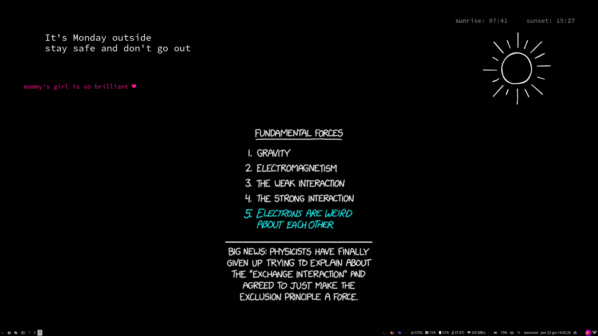

# I3WM arch rice

This script downloads the latest XKCD comic, processes the image, and creates a custom wallpaper with additional information such as the current day, sunrise/sunset times, and a motivational message.



## ✨ Features

- **XKCD Integration**: Downloads the latest comic from XKCD.
- **Image Processing**: Crops, resizes, and enhances the comic image.
- **Custom Overlay**: Adds text information such as:
  - Current day of the week.
  - Sunrise and sunset times based on geographical coordinates.
  - A motivational message generated via the `mommy` command.
- **Day/Night Theme**: Displays either a sun or moon icon based on the current time.
- **Wallpaper Update**: Automatically sets the generated image as the desktop wallpaper using `feh`.

## Requirements

### 🐍 Python Libraries
- `requests`
- `Pillow` (PIL)
- `os`
- `subprocess`
- `re`
- `datetime`

### ⚙️ System Tools
- `mommy`: Provides motivational quotes.
- `sunwait`: Calculates sunrise and sunset times.
- `feh`: Sets the desktop wallpaper.

## 🛠 Usage
1. Update paths
2. Change coordinates for sunwait
3. Run the script ```python script.py```

## Contribute
1. Fork the repository.
2. Create a new branch  
    ```git checkout -b feature-branch```
3. Make your changes and commit them  
    ```git commit -am 'Add new feature'```
4. Push to your branch  
    ```git push origin feature-branch```
5. Create a pull request.

## Test locally
```git clone https://github.com/mzums/arch-i3wm-rice```
